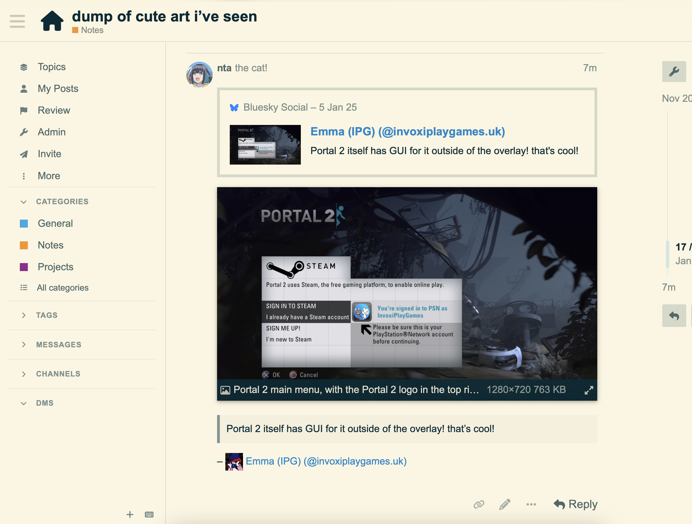

# bsky-bookmarker

a quick (WIP) tool for a specific use case of mine: bookmarking (and archiving) art to a personal/private Discourse instance.

this is _meant_ to be hooked up to some app-driven entry point somewhen but for now I'm fine invoking this from the command line on one of my machines, bweh~

## How to run this?!
you probably don't want to, but-

1. `corepack pnpm install`
2. set up a `.env` with the right variables (in the path that [env-paths](https://github.com/sindresorhus/env-paths) decided upon, like `~/Library/Preferences/bsky-bookmarker-nodejs/.env`)
3. `corepack pnpm start 'https://bsky.app/profile/hnvhertnveifvchjefnidjm/post/gjivnkefrijvnemrokfc'`
4. remove the cache dir (also decided upon by env-paths) every so often as there's no expiration logic and this is mainly there so that my experiments don't hit rate limits

alternately if you're daring, `pnpm install -g https://github.com/nta/bsky-bookmarker.git` and `bsky-bookmarker 'https://bsky.app/profile/hnvhertnveifvchjefnidjm/post/gjivnkefrijvnemrokfc'` (it'll tell you how to set it up)

## ideas/todos
- ~~running from cwd is weird, make it work as an installed thing fine~~ it does now
- this needs to be hooked up to something more persistent (an app share target? not just a cli)
- support multiple topics
- support descriptions (so i remember why i bookmarked something!!)
- support admin api keys
- test videos
- cache should be less rude

## Screenshots?!

*([this](https://bsky.app/profile/invoxiplaygames.uk/post/3ley3yy57xk2o) isn't art but hey)*

## Acknowledgements
some logic in here is taken from a few other places as reference, this is usually annotated inline, but notably so:

- this uses [mary](https://mary.my.id)'s [atcute](https://github.com/mary-ext/atcute) because why wouldn't it ;3
- [julie](https://juli.ee)'s [pdsls](https://github.com/notjuliet/pdsls) was referenced for some lookup logic